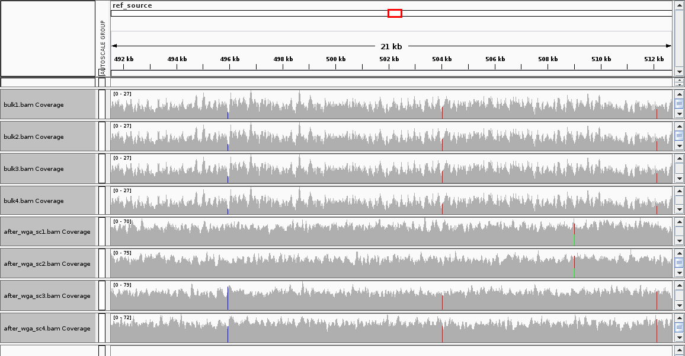

# SCSIM: Jointly Simulating Correlated single-cell and bulk next-generation sequencing data

This is a tool for simulating  next-generation sequencing data from a hierarchical sampling arrangement with single-cell and bulk samples.

## Getting Started

1. Clone the repository to your computer.
2. Inside the repository, run `make all` to build the **SCSIM** docker image and run the example.

### Prerequisites

- docker

### Installing 

You can run the project directly from a docker container by running `make all` which runs `make build` and `make example`.

The conda environment can be installed using `make env`. But, the example needs to run `monovar` which requires a different version of python. So, it's best to build the example using the `make all` command.

## Running the tests

The `scsim` docker image must be built before running the example. 

1. Navigate the `example` directory in the repository.
2. Run `make all`

A docker container will be created and the example simulation will be run in the container.
The simulation output will appear in the `example` folder because a shared volume is created in the container that connects to the `example` folder.

The `example/test` folder contains expected results: a csv file showing the actual SNV locations across the three prototypes and txt files showing where bcftools and monovar called SNVs.

An IGV plot of the example output is shows shares mutations in bulk and single-cell samples.

## Contributing
If you'd like to contribute please fork the repository and submit a pull request.
Or if you find an issue, add an issue to the github repository.

## Authors

* Collin Giguere
* Hachem Saddiki
* Patrick Flaherty
* Vishal Sarsani
* Harsh Dubey

## License

license:mit

## Acknowledgements
